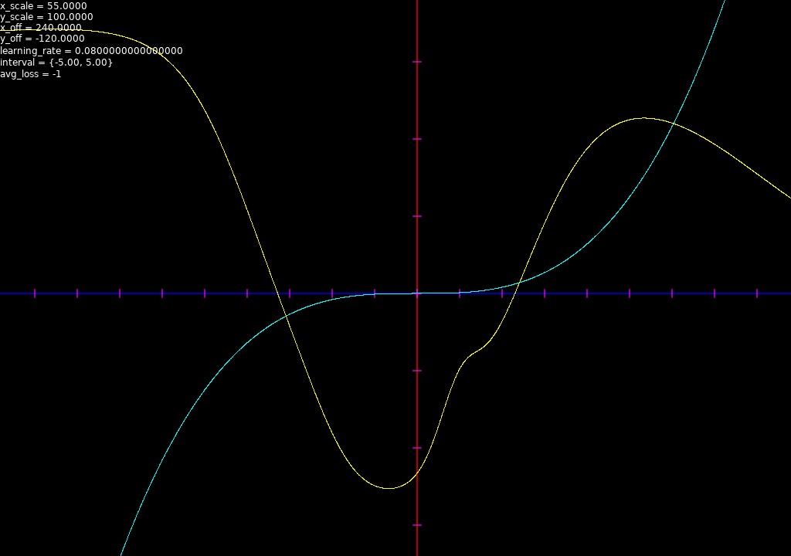
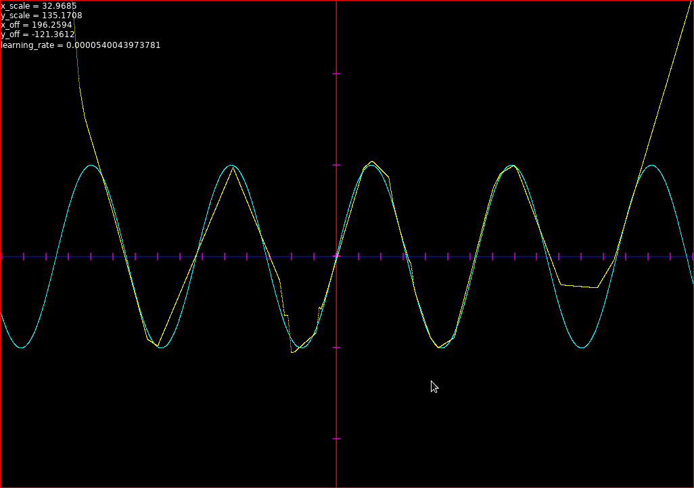
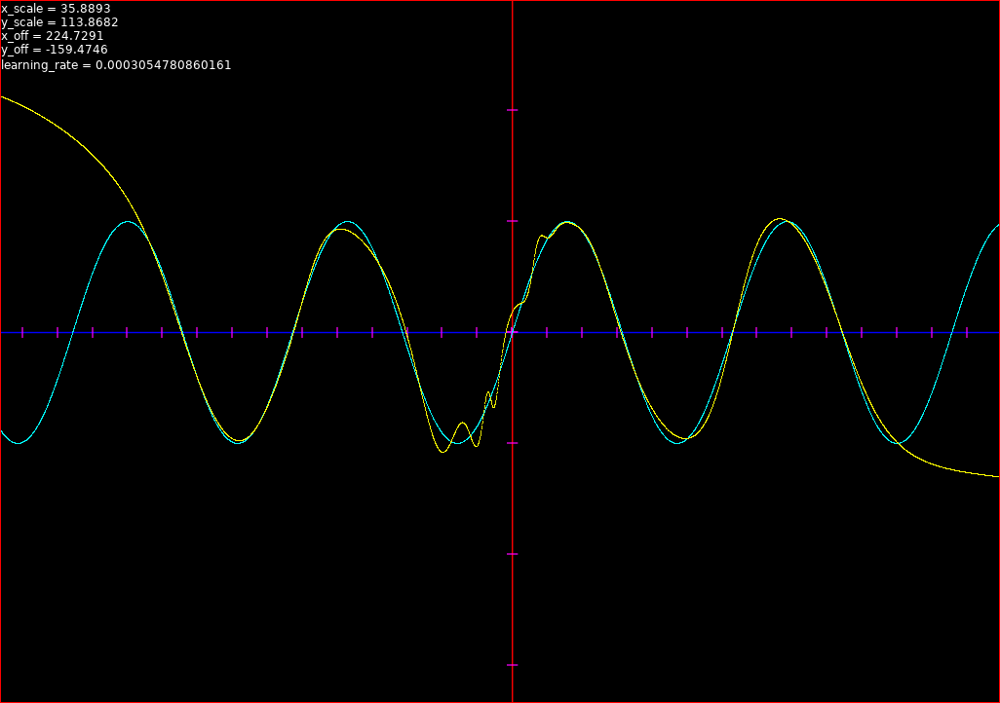

# nn.lua
Small and simple neural network library in a single lua file.
Good for learning neural networks & playing with machine learning.

## Usage
Simply copy `nn.lua` into your project and require it.

`examples/learn_xor.lua` is a small but complete example of typical usage.

In short:
```lua
-- Rrequire the module
local nn = require("nn")

-- Initialize the network
local net = nn.new_neural_net({
   neuron_counts = {2, 4, 1},
   act_fns = {"sigmoid", "sigmoid"}
})

-- Train it
nn.train(net, training_data, {
   epochs = 1000,
   learning_rate = 0.1
})

-- Use it
local outputs = nn.feedforward(net, {inputs={10, 20}})
print(outputs[1])
```

### API
In general, I suggest you look at `nn.lua` if you want to know the API. The code
is commented and written to be as simple as possible. If you wish to know
exactly what `opts` a function accepts, just look at the first 5-10 lines of
that function, it's all there.

Regardless, here are some details about the API:

### `nn.new_neural_net(opts)`
Creates a new neural network, which will look something like this:
```lua
{
  neurons = { { 1, 1 }, { 2, 2, 2, 2 }, { 3 } },
  weights = {
    { -4.79, 1.48, -4.18, 0.05, -2.8, 4.66, 0.14, -0.86 },
    { -4.1, 4.12, -2.62, -3.72 }
  }
  biases = {
    [2] = { 0.59, -1.39, 2.31, -0.42 }
  },
  act_fns = { "relu", "relu" },
  raw_act_fns = { <function 1> },
  raw_d_act_fns = { <function 2> }
}
```

The weights and biases can be randomized or assigned. The `raw_*` functions are
used internally. The neuron values are just placeholders, used only for caching
activations during backpropagation.

`act_fns` is a string array, which denotes the activation functions between
neuron layers. So, if we have 4 layers and `act_fns = {"sigmoid", "relu"}`, then
from layer 1 to layer 2 a sigmoid function will be applied and from layer 2 to
layer 3 a relu will be applied. After that the values are `nil`, so from layer 3
to layer 4, no function will be applied to the neuron activations, which is
equivalent to a linear activation function.

#### Saving/loading a neural network

The `nn.new_neural_net(opts)` function can also be used to load and initialize
an existing neural network.

```lua
-- Say we create a randomized net
local net = nn.new_neural_net({
   neuron_counts = {2, 4, 1},
   act_fns = {"sigmoid"},
})

-- We trained it and now want to save it to disk for later usage

-- We get a string dump of the trimmed network.
local net_str = inspect(nn.compress(net)) -- inspect() does good-enough "serialization"

-- This will write "return { ... net contents .. }" into the lua file,
-- which makes it easier to load later using require()
local file = io.open("net.lua", "w")
file:write("return ")
file:write(net_str)

-- Some time later we want to load and use it
local loaded_net = nn.new_neural_net(require("net"))
print(nn.feedforward(loaded_net, {inputs={...}}))
```

## Examples

### Simple examples
To run the standalone lua files, stand on the base directory of the repository and do:
```
$ luajit examples/learn_xor.lua
```

### Interactive function approximator example
You need Love2D installed to run this one:
```
$ love examples/approx/
```

The controls are the arrow keys, hjkl, and 'g' to toggle training. You should
get something like this:



## Screenshots
Approximating a sine wave in the range [-10, 10] using a single 100-neuron
hidden layer using a ReLU activation function. The training data is only 100
random samples from the sine wave from the given range.

After approximately one hour of training:



Notice how the network doesn't care to fit anything beyond the range [-10, 10]
as it doesn't have the data for it.

A close up:


When the same is done using a sigmoid function instead, the results are much
better.

After 5 minutes:



## TODO
- remove 'opts' from nn.feedforward and replace it with just inputs (if nil, don't use)
- rewrite approx to work with new graphlove
- move lib/ into examples/.
- get MNIST to work and make an example ( http://yann.lecun.com/exdb/mnist )
- Make a GAN (that draws squares maybe?)
- Solve a rubik's cube
- Potential optimizations include:
  - rewrite in C
  - use SIMD
  - use matrix multiplication w/ video card instead of cartesian nested loop


## License (3-clause BSD)
```
Copyright 2022 Nikoloz Otiashvili.

Redistribution and use in source and binary forms, with or
without modification, are permitted provided that the following
conditions are met:

1. Redistributions of source code must retain the above copyright
   notice, this list of conditions and the following disclaimer.

2. Redistributions in binary form must reproduce the above
   copyright notice, this list of conditions and the following
   disclaimer in the documentation and/or other materials
   provided with the distribution.

3. Neither the name of the copyright holder nor the names of its
   contributors may be used to endorse or promote products
   derived from this software without specific prior written
   permission.

THIS SOFTWARE IS PROVIDED BY THE COPYRIGHT HOLDERS AND
CONTRIBUTORS "AS IS" AND ANY EXPRESS OR IMPLIED WARRANTIES,
INCLUDING, BUT NOT LIMITED TO, THE IMPLIED WARRANTIES OF
MERCHANTABILITY AND FITNESS FOR A PARTICULAR PURPOSE ARE
DISCLAIMED. IN NO EVENT SHALL THE COPYRIGHT HOLDER OR
CONTRIBUTORS BE LIABLE FOR ANY DIRECT, INDIRECT, INCIDENTAL,
SPECIAL, EXEMPLARY, OR CONSEQUENTIAL DAMAGES (INCLUDING, BUT NOT
LIMITED TO, PROCUREMENT OF SUBSTITUTE GOODS OR SERVICES; LOSS OF
USE, DATA, OR PROFITS; OR BUSINESS INTERRUPTION) HOWEVER CAUSED
AND ON ANY THEORY OF LIABILITY, WHETHER IN CONTRACT, STRICT
LIABILITY, OR TORT (INCLUDING NEGLIGENCE OR OTHERWISE) ARISING IN
ANY WAY OUT OF THE USE OF THIS SOFTWARE, EVEN IF ADVISED OF THE
POSSIBILITY OF SUCH DAMAGE.
```
